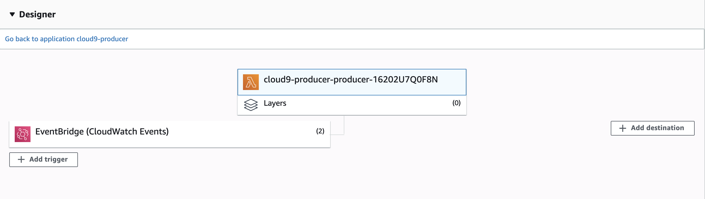

# Severless Data Pipeline in AWS

This project aims to automate the process of collecting tweets from Twitter in a regular basis and store data in S3 bucket. Right now, this project is scheduled to collect Downald Trump's most recent tweets every 6 hour, perform sentiment analysis using AWS Comprehend on his tweets and save into S3 bucket.

## Motivation
I want to build a data pipeline to automate the process of data collection in real time. The data pipeline should be able to collect and store data from any source given valid API and access previliage(Twitter, Wikipedia and, etc.). And I, as a user, can easily change the frequency of data scrapping.

## Features
- 100% built and deployed on AWS
- Serverless Data Pipeline built with Lambda, SQS, DynamoDB and S3
- Utilized AWS machine learning service Comprehend
- CI+CD(To be finished)

## Screenshots
Producer Lambda Function Design Graph:

Consumer Lambd Function Design Graph: 

## Framework
Data Pipelien Diagram:

Interested in my web app? https://github.com/wensu425/aws-eb-webapp.git
